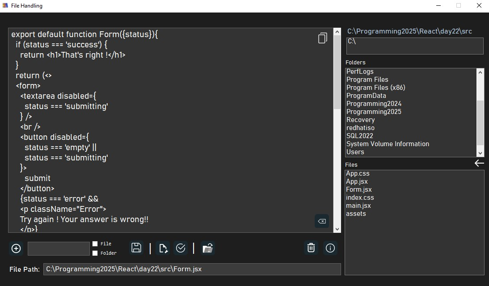
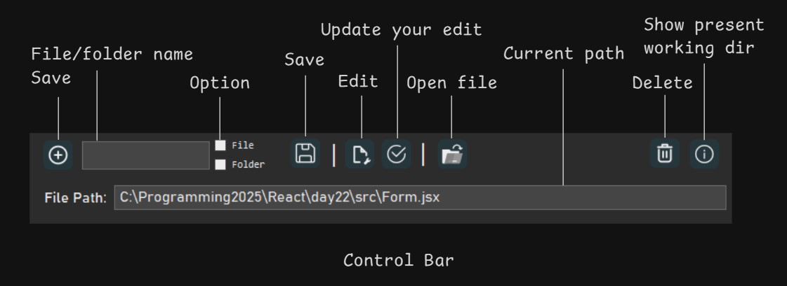
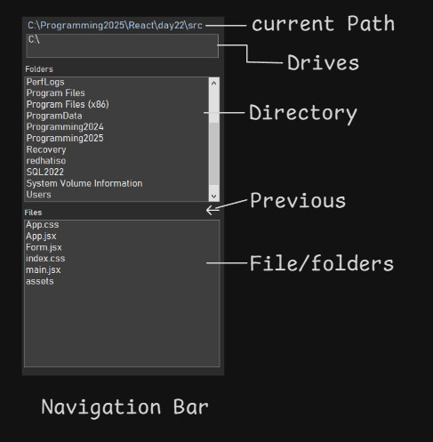
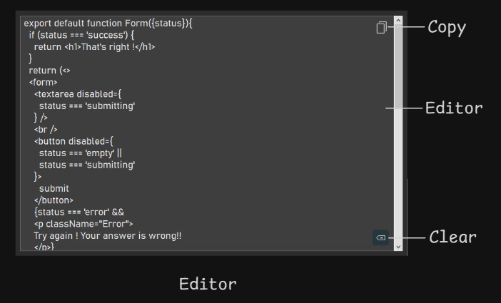

#  File Handler - v2.0  

## 📃 Overview  
The **File Handling Application** is a Windows-based utility developed using the .NET Framework. It allows users to seamlessly interact with their file and directory systems. With this application, users can:  
- **Read**, **write**, **update**, and **create** files and directories.  
- Manage their file hierarchy from a single, intuitive interface.  
## 🌟 Intoduction
This tool is designed to enhance file management interactivity and help users keep track of their files effortlessly.  

## **1. Control Bar**

 

**The Control Bar provides quick access to essential file operations and system information:**
- **File/Folder Name**: Input the name for new files or folders.
- **Save**: Create and save new files or folders.
- **Option**: Toggle between creating a file or a folder.
- **Edit**: Modify the contents of an existing file.
- **Update Your Edit**: Save changes made to a file.
- **Open File**: Browse and open an existing file from your directory.
- **Current Path**: Displays the current working directory.
- **Delete**: Remove selected files or folders.
- **Show Present Working Directory**: View the active directory location.
 

## **2. Navigation Bar**

 

**The Navigation Bar simplifies file and folder exploration:**
- **Current Path**: Displays the location of the selected file or folder.
- **Drives**: List of available drives for navigation.
- **Directory**: Shows the folder structure within the current path.
- **Previous**: Navigate back to the previous directory.
- **File/Folder List**: Displays files and folders in the selected directory for quick access.

 

## **3. Editor**

**The Editor is where you can view and modify file contents:**
 
- **Copy**: Quickly copy the text from the editor to the clipboard.
- **Editor**: View or edit the contents of the selected file.
- **Clear**: Remove all text from the editor to start fresh.

 

## What's New in v2.0  
- **Folder**: User can create folder also. 
- **Installer Available**: You can now install the application directly on your system.  

## ❗ Terms & Conditions  
By installing and using the **File Handling Application**, you agree to the following terms:  
- You acknowledge the application may trigger security warnings from Windows Firewall during installation.  
   - **Windows Firewall Warning**: This application is not currently authorized by Windows Firewall. During installation, you may receive a security warning. Please accept the warnings and allow the installation to proceed. You can trust this application, as it is safe to install and use.  
   - Once installed, enjoy managing your files and directories with ease!
- You agree to use the application for personal or professional file management purposes only.  

Feel free to report any issues or contribute to the repository by submitting pull requests or issues.

---

Made with ❤️ by [prince-gh](https://github.com/prince-gh)
